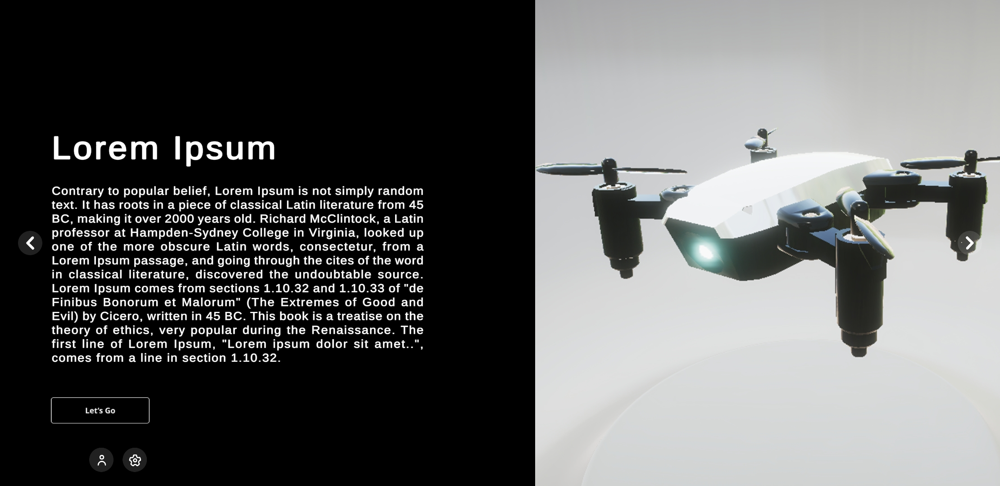
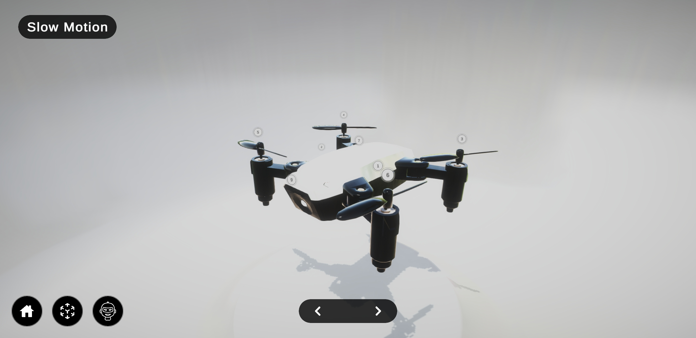
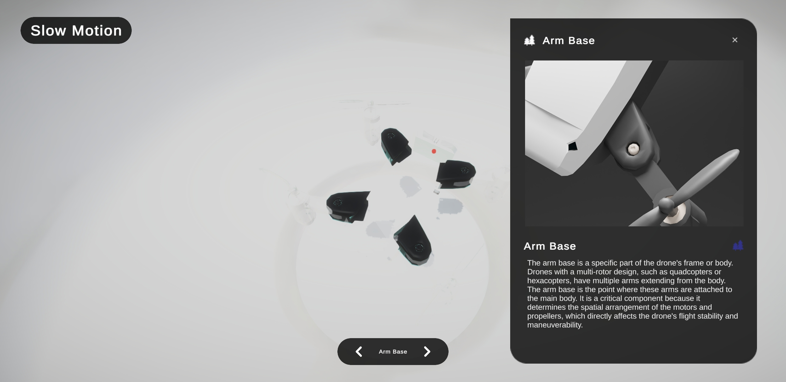
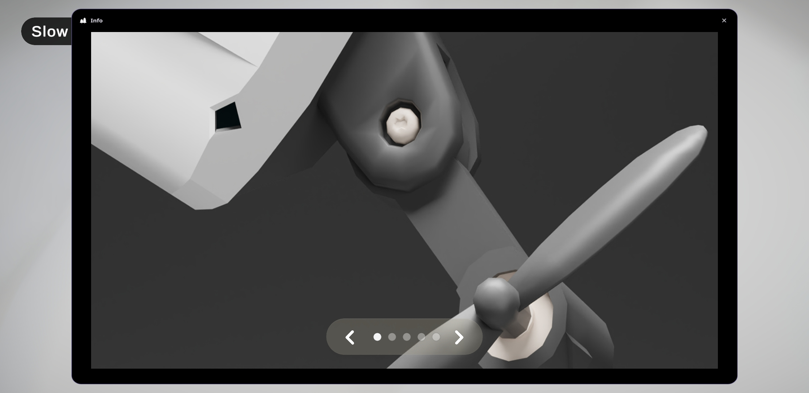
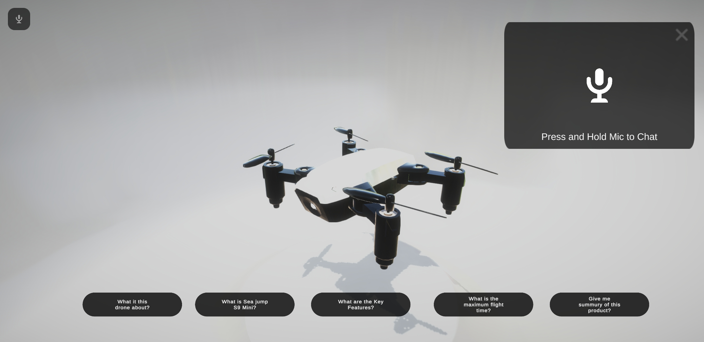
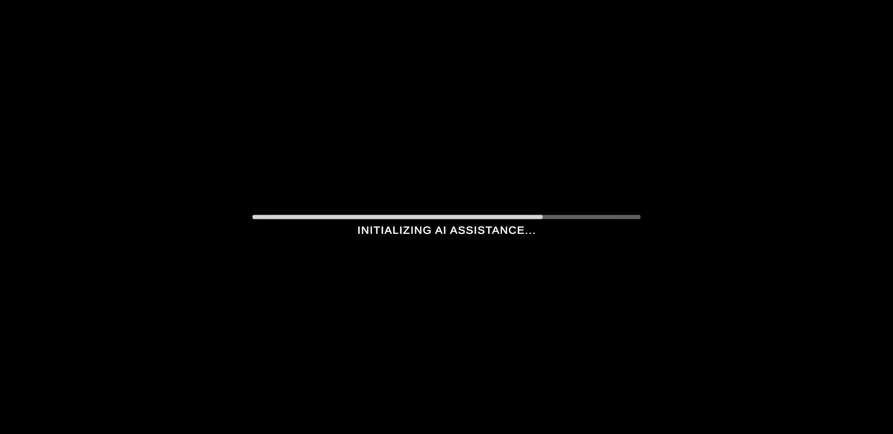
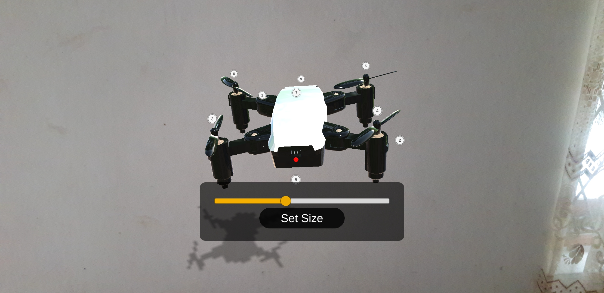
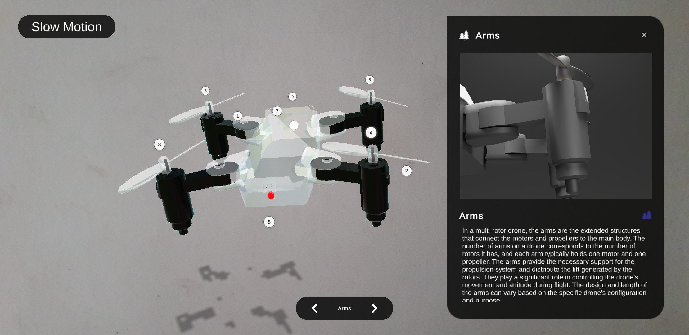

# AR PRODUCT SIMULATOR APPLICATION


> The AR Product Simulator Application revolutionizes the way users interact with and understand products by combining immersive 3D simulation with intuitive user experiences. Designed for both professionals and enthusiasts, this application allows users to visualize products in both AR (Augmented Reality) and non-AR modes, providing unmatched flexibility in how products are explored.

>With ProductSim, every product comes to life in full three-dimensional detail. Users can zoom in to inspect intricate components, rotate objects for a 360-degree perspective, and dissect individual parts to see how each element contributes to the whole. This level of interactivity is ideal for learning, training, and product demonstrations, giving users a hands-on understanding without physical prototypes.

>The application is further enhanced by its AI-powered Talkable Instructor, an intelligent guide that provides real-time explanations, insights, and step-by-step instructions. Whether you’re exploring complex machinery, electronic devices, or educational models, the AI Instructor ensures that users gain deep comprehension and meaningful interaction with the product.

>ProductSim’s interface is designed to be educational, intuitive, and highly engaging. It bridges the gap between theoretical knowledge and practical experience, making it suitable for training professionals, educating students, or providing immersive product previews for clients and consumers. The platform supports detailed annotations, interactive guides, and dynamic simulations, ensuring users can learn at their own pace while remaining fully engaged.

>By combining cutting-edge AR technology, intelligent AI guidance, and interactive 3D visualization, the AR Product Simulator Application transforms product exploration into a rich, immersive, and unforgettable experience. Users no longer just view products—they interact, understand, and master them in ways previously only possible with physical hands-on access.

---

## KEY FEATURES

<details open>
  <summary>
    
  </summary>

- Visualize 3D products in your physical space for a realistic, interactive AR experience.
</details>

<details open>
  <summary>
    
  </summary>

- Seamlessly explore 3D models with or without AR, ensuring accessibility for all users.
</details>

<details open>
  <summary>
    
  </summary>

- Interact with individual product parts. Zoom, rotate, and dissect components to gain comprehensive insights into design and functionality.
</details>

<details open>
  <summary>
    
  </summary>

- Ask questions and receive real-time responses from the AI companion, offering guidance, specifications, and detailed information.
</details>

<details open>
  <summary>
    
  </summary>

- Navigate seamlessly between 3D models, AI assistance, and app features with an intuitive interface.
</details>

<details open>
  <summary>
    
  </summary>

- Gain in-depth knowledge of product features, design, and functionality. Ideal for professionals and curious users alike.
</details>

---

## Screenshots

<details open>
  <summary>
    
  </summary>

  
</details>

<details open>
  <summary>
    
  </summary>

  
</details>

<details open>
  <summary>
    
  </summary>

  
</details>

<details open>
  <summary>
    
  </summary>

  
</details>

<details open>
  <summary>
    
  </summary>

  
</details>

<details open>
  <summary>
    
  </summary>

  
</details>

<details open>
  <summary>
    
  </summary>

  
</details>

<details open>
  <summary>
    
  </summary>

  
</details>

---

## Project Summary

| **Category**       | **Details**                           |
|--------------------|---------------------------------------|
| **Devices**        | Android ARCore supported & Non-AR devices |
| **Languages**      | C#                                     |
| **API**            | Conva AI API                                |
| **Version Control** | GitHub                                 |
| **Deployment**     | Unity                                   |

---

## Installation

```bash
# Clone the repository
git clone https://github.com/yourusername/yourrepository.git
cd yourrepository

# Install dependencies if any
npm install
