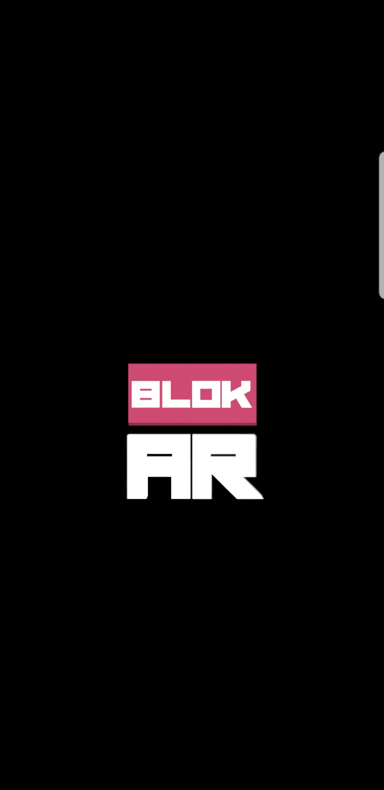
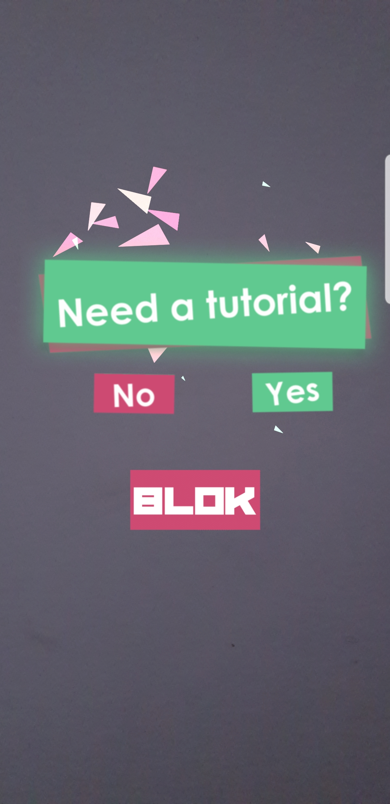
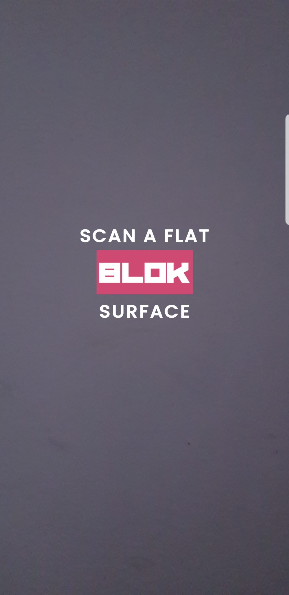
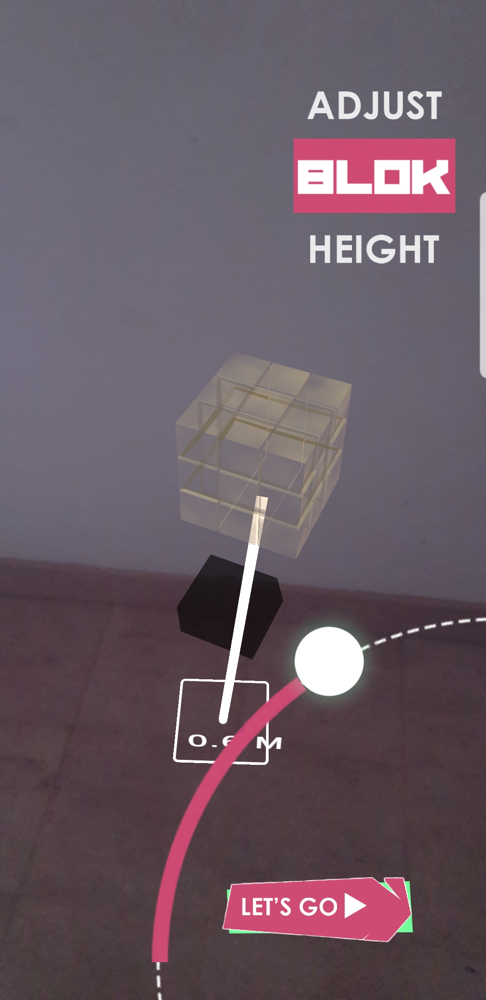
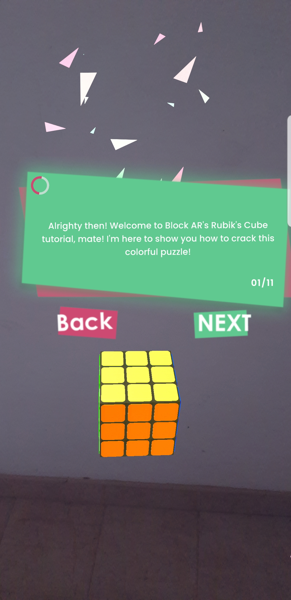
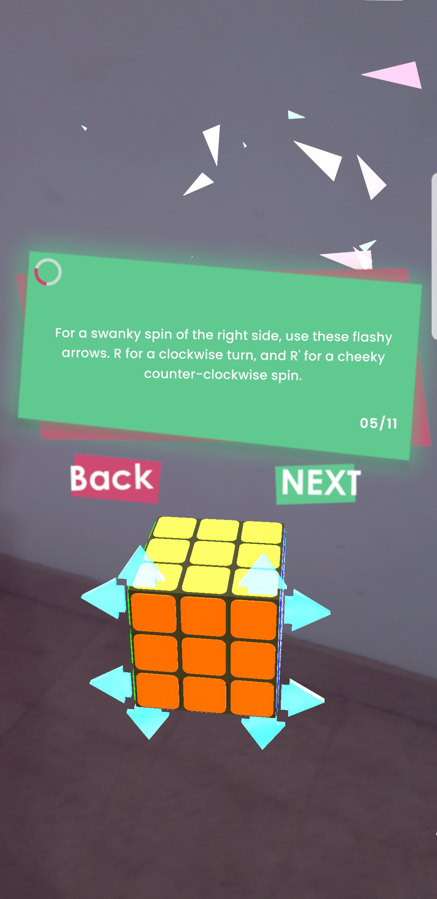
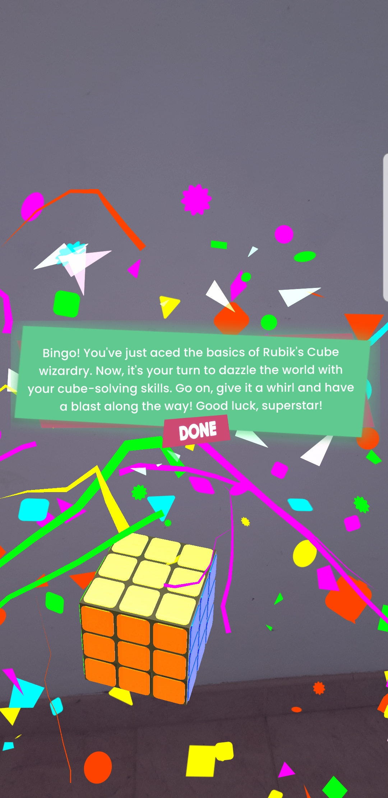
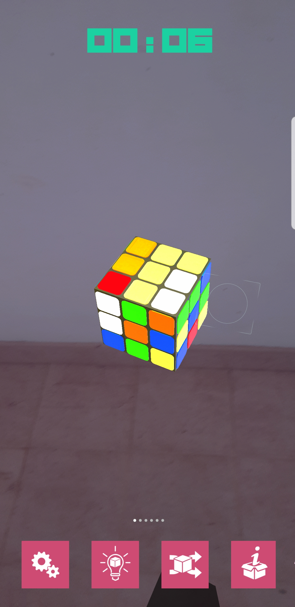
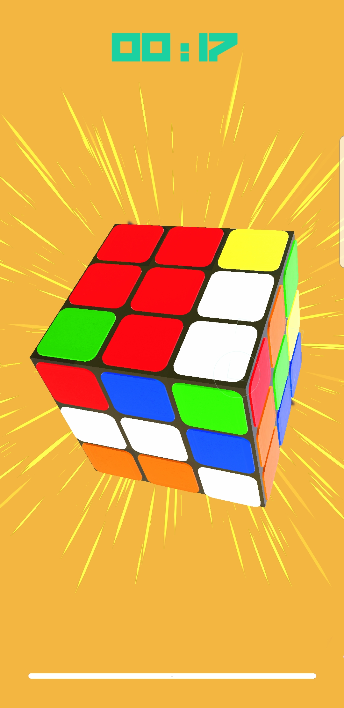

# BLOCK AR 3X3X3 RUBIK SOLVER APPLICATION

  

> Introducing Block AR – the revolutionary augmented reality (AR) game that brings the timeless Rubik's Cube into a vibrant, interactive 3D world. Step into a captivating universe where puzzles are no longer confined to your hands but unfold in augmented reality, allowing you to spawn virtual Rubik's Cubes, manipulate them in real space, and watch them solve themselves in real-time. Whether you’re a curious beginner or a seasoned cuber, Block AR transforms the way you experience one of the world’s most iconic puzzles.

> At the heart of Block AR is its immersive tutorial mode, designed to teach and refine solving skills. Players can embark on a guided journey, learning strategies, algorithms, and techniques to master the art of solving the cube. For those seeking a more interactive experience, the game provides dynamic, hands-on challenges where each cube responds to your gestures, rotations, and inputs, blending the tactile joy of physical cubing with the limitless possibilities of augmented reality.

> Block AR goes beyond traditional gameplay by introducing a learning and adaptive AI system. As players interact with cubes, the game observes solving patterns, tracks progress, and evolves to offer personalized challenges and insights, making each session uniquely tailored to the player’s skill level. The intuitive interface ensures beginners can quickly grasp the basics, while advanced cubers can tackle complex patterns and speed-solving challenges, providing endless replayability and growth.

> The game’s vibrant visuals and realistic cube mechanics immerse players in a world where puzzles pop with bright colors, smooth rotations, and intricate patterns. It’s not just a game—it’s a fusion of nostalgia, innovation, and interactive entertainment. Block AR invites you to explore, experiment, and push the boundaries of what a Rubik’s Cube can be in augmented reality.

> Whether you’re seeking a fun and engaging pastime, a brain-boosting challenge, or a new way to showcase your cubing skills, Block AR delivers a rich, immersive experience that transforms each puzzle into an exciting adventure. Download Block AR today and discover a world where cubes come to life, challenges unfold, and the joy of solving is reimagined for the AR era.

> ⚠️ **Note**: Due to confidentiality agreements, source code cannot be
> shared. This focuses on key features,
> and user interface design.

---

## KEY FEATURES

  

    
  

- Spawn and interact with virtual Rubik's Cubes in AR for a visually stunning and interactive experience.

  

    
  

- Watch Rubik's Cubes solve themselves in real-time, adding a dynamic and engaging element to gameplay.

  

    
  

- Step-by-step tutorial guides beginners through the fundamentals of Rubik's Cube solving with helpful tips.

  

    
  

- The game observes player solving techniques and adapts, providing a personalized and educational experience.

  

    
  

- Spawn cubes at your fingertips, manipulate them intuitively, and enjoy a tactile AR interaction.

  

    
  

- High-quality, optimized 3D assets ensure smooth performance while maintaining stunning visual detail for all cubes.

---

## Screenshots

  

    
  

  

  

    
  

  

  

    
  

  

  

    
  

  

  

    
  

  

  

    
  

  

  

    
  

  

  

    
  

  

  

    
  

  

  

    
  

  

---

## Project Summary

| **Category**       | **Details**                           |
|--------------------|---------------------------------------|
| **Devices**        | Android ARCore supported devices      |
| **Languages**      | C#                                     |
| **API**            | None                                   |
| **Version Control** | GitHub                                 |
| **Deployment**     | Unity                                   |

