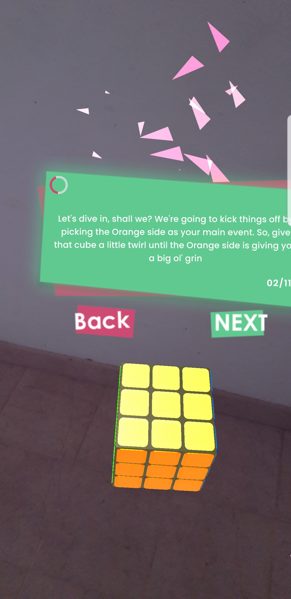
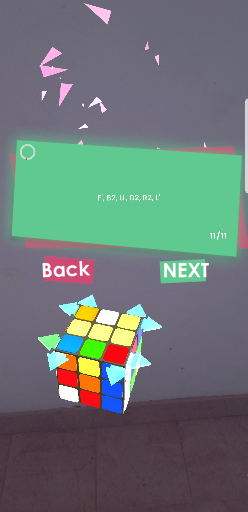
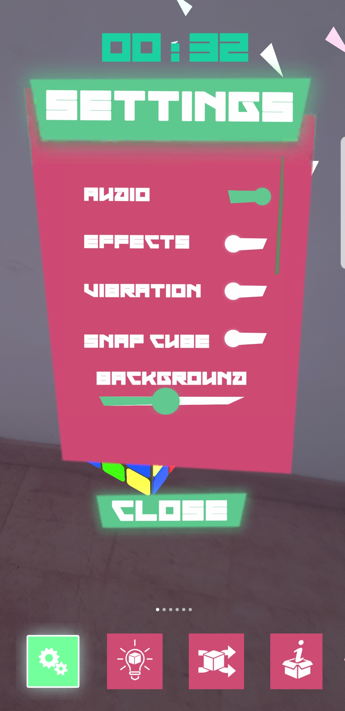
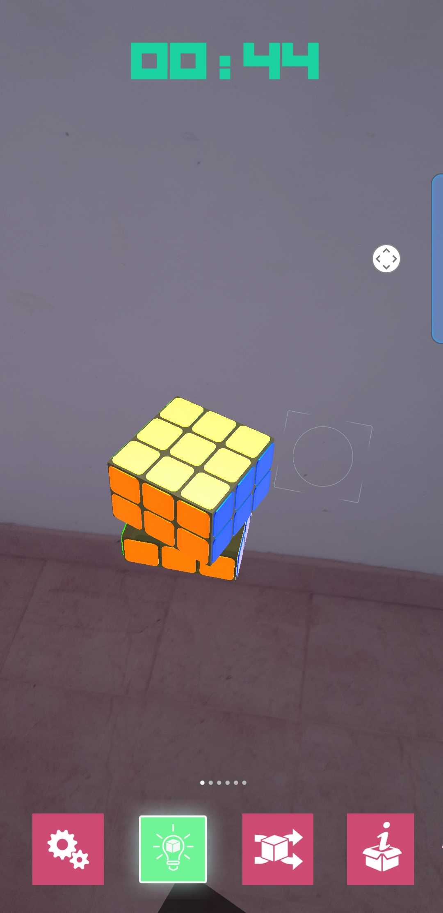
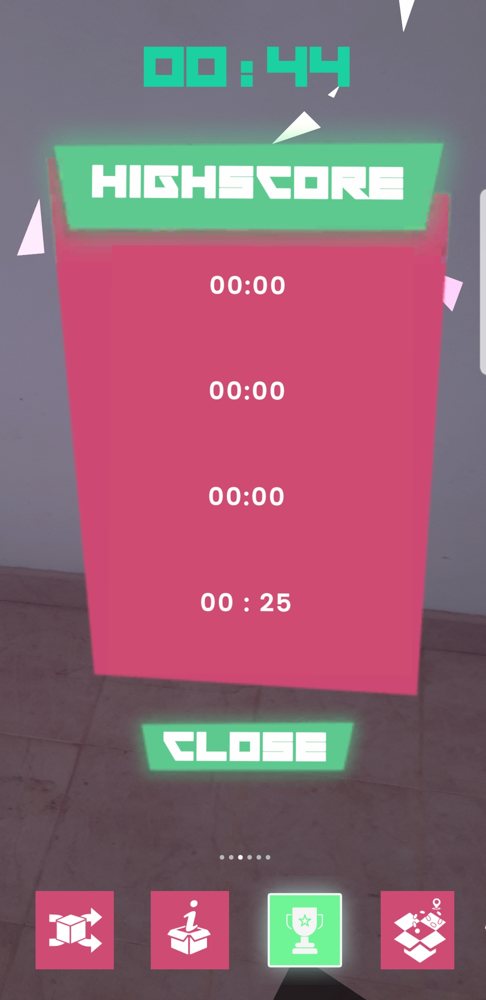
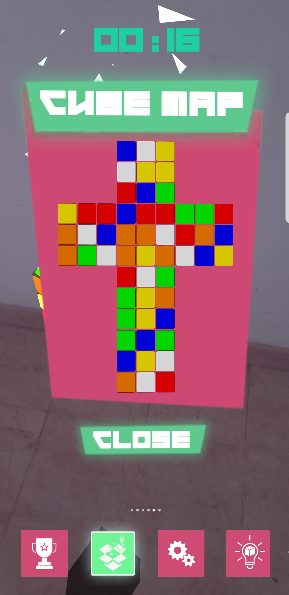

# BOLCK AR 3X3X3 RUBIC SOLVER APPLICATION


Introducing Block AR, the revolutionary augmented reality (AR) game that brings the classic Rubik's Cube to life in a whole new dimension. Immerse yourself in the captivating world of Block AR, where you can not only spawn virtual Rubik's Cubes but also witness them being solved in real-time. With an innovative tutorial mode, players can hone their solving skills or embark on a learning journey to master the art of solving the iconic puzzle.

Block AR transcends traditional gaming by combining the tactile joy of manipulating a Rubik's Cube with the immersive experience of augmented reality. Spawn cubes at your fingertips and watch as they come to life, challenging you with their vibrant colors and intricate patterns. The game caters to both novices and seasoned cubers, providing an intuitive interface for beginners to grasp the fundamentals while offering advanced challenges for those seeking a true test of their cubing prowess.

What sets Block AR apart is its unique feature that allows the game itself to learn and adapt. As players progress, the game observes their solving techniques and evolves, offering a dynamic and personalized experience. Whether you're a casual gamer looking for a fun and engaging experience or a Rubik's Cube enthusiast eager to showcase your skills in a new virtual realm, Block AR is the ultimate fusion of nostalgia, innovation, and interactive entertainment. Download Block AR now and embark on a journey where cubes come to life, challenges unfold, and the joy of solving is redefined in augmented reality.

## KEY FEATURES

<details>
  <summary><strong>Augmented Reality Rubik's Cubed</strong></summary>

  - Immerse yourself in the augmented reality world where virtual Rubik's Cubes come to life, offering a visually stunning and interactive gaming experience.
</details>

<details>
  <summary><strong>Real-time Cube Solving</strong></summary>

  - Watch in amazement as the virtual Rubik's Cubes are solved in real-time, adding a dynamic and engaging element to the gameplay.
</details>

<details>
  <summary><strong>Tutorial Mode</strong></summary>

  - Perfect for beginners, the tutorial mode guides players through the fundamentals of solving the Rubik's Cube, providing step-by-step instructions and tips.
</details>

<details>
  <summary><strong>Learn to Solve</strong></summary>

  - Block AR goes beyond traditional gaming by allowing players to embark on a learning journey. The game observes and adapts to the player's solving techniques, providing a personalized and educational experience.
</details>

<details>
  <summary><strong>Interactive Spawning</strong></summary>

  - Spawn Rubik's Cubes at your fingertips, offering a tactile and intuitive way to manipulate and engage with the virtual puzzles.
</details>

<details>
  <summary><strong>Optimized and Detailed Assets </strong></summary>

  - Every celestial element within Stargaze is meticulously crafted, offering a balance of optimized performance and stunning detail. The application boasts highly detailed assets that bring the universe to life, from the intricate textures of planets to the realistic movements of orbiting bodies. Stargaze achieves a perfect synergy between visual fidelity and operational efficiency, providing an immersive experience without compromising on quality.
</details>

## Screenshots
<details>
  <summary><strong>Landing Page </strong></summary>
  
  
  
</details>

<details>
  <summary><strong>Chose Game Type</strong></summary>

  
  
</details>

<details>
  <summary><strong>Scanning Suface</strong></summary>

  
  
</details>

<details>
  <summary><strong>Mesh Spawn</strong></summary>

  
  
</details>
  <details>
  <summary><strong>Adjust Transform</strong></summary>

  
  
</details>
  <details>
  <summary><strong>Voice and Text Narrations</strong></summary>

  
  
</details>
  <details>
  <summary><strong>Voice and Text Narrations</strong></summary>

  
  
</details>
  <details>
  <summary><strong>Layer Movements</strong></summary>

  
  
</details>
  <details>
  <summary><strong>Layer Movements</strong></summary>

  
  
</details>

<details>
  <summary><strong>Win</strong></summary>

  
  
</details>

<details>
  <summary><strong>InGame UI</strong></summary>

  
  
</details>

<details>
  <summary><strong>Smooth Rotation</strong></summary>

  
  
</details>

<details>
  <summary><strong>UI Window</strong></summary>

  
  
</details>

<details>
  <summary><strong>UI Window</strong></summary>

  
  
</details>

<details>
  <summary><strong>UI Window</strong></summary>

  
  
</details>

<details>
  <summary><strong>UI Window</strong></summary>

  
  
</details>

</details>

## Project Summary

| Tittle         | Description             |
|------------------|-------------------------------------|
| **Devices**     | android ARCore supported devices                  |
| **Languages**      | C#                    |
| **API**     |                              |
| **Version Control** | GitHub                        |
| **Deployment**   | Unity                       |


## Installation

Provide step-by-step instructions on how to install your project.

```bash
# Example installation commands
git clone https://github.com/yourusername/yourrepository.git
cd yourrepository
npm install
