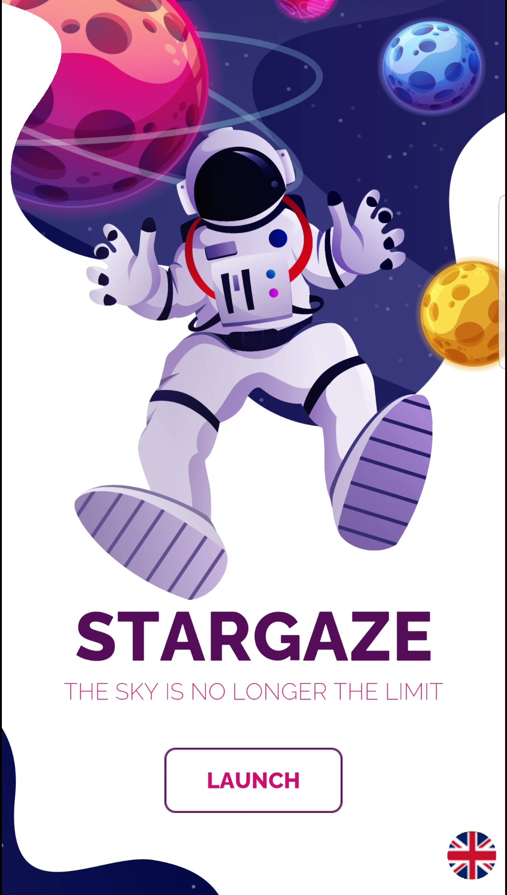
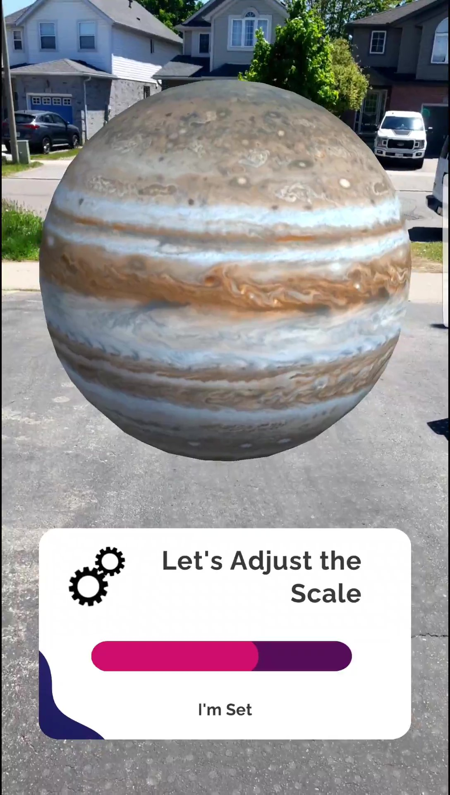
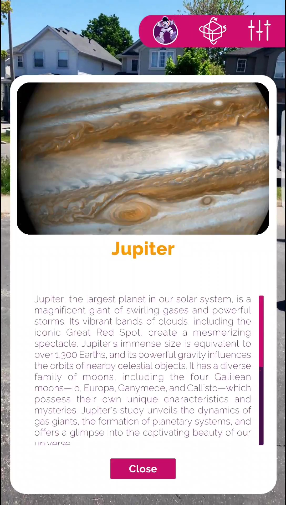
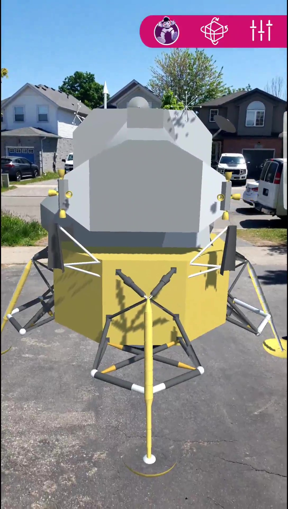

# STARGAZE AR ASTRONOMICAL LEARNING APPLICATION


> Stargaze is a mesmerizing augmented reality (AR) application meticulously designed for Android AR-supported devices, bringing the wonders of the cosmos right into your hands. Developed with Unity AR Core and C#, Stargaze transforms ordinary surroundings into a celestial playground, where the line between reality and imagination fades, and the universe becomes your canvas.

> Step into the infinite expanse of space with Stargaze, where planets, stars, moons, and entire solar systems can be summoned and explored at your fingertips. Every celestial body is rendered in stunning detail, allowing users to zoom, rotate, and interact with the universe like never before. The app offers a deeply immersive experience, giving users a feeling of true cosmic presence, as if they were floating among the stars themselves.

> Beyond simply visualizing space, Stargaze invites users to engage with astronauts, spacecraft, comets, and galaxies, creating interactive scenarios that combine learning and entertainment. Its dynamic features allow users to experiment with cosmic phenomena, observe orbital motions, and design their own interstellar arrangements, effectively turning every session into an educational adventure.

> The app’s intuitive interface ensures both novices and astronomy enthusiasts can navigate the cosmos effortlessly. Beginners can explore celestial bodies with guided interactions, while advanced users can experiment with complex simulations and construct entire galaxies, fostering creativity and curiosity in ways traditional astronomy apps cannot.

> Stargaze is more than an AR application—it is a portal to another dimension, empowering users to become cosmic architects, shaping their own universe with simple gestures. Every interaction is a step closer to understanding the grandeur of the cosmos, making the app both entertaining and educational.

> Whether you are a space enthusiast, student, educator, or casual explorer, Stargaze provides an unforgettable AR experience, blending scientific discovery with wonder and creativity. Embark on a celestial odyssey today and witness the universe like never before—where stars, planets, and galaxies are no longer distant dots in the sky but tangible, interactive wonders right at your fingertips.

> With Stargaze, the cosmos is not just something you observe—it’s something you create, explore, and truly experience.

---

## KEY FEATURES

<details open>
  <summary>
    
  </summary>

- Spawn planets, stars, moons, and entire solar systems into your surroundings. Interact with them as planets orbit, stars twinkle, and moons change phases in real-time.
</details>

<details open>
  <summary>
    
  </summary>

- Asset bundles ensure smooth performance and lightning-fast loading. Enjoy high-quality AR interactions without delays or lag.
</details>

<details open>
  <summary>
    
  </summary>

- Fully compatible with Android ARCore-supported devices, allowing a wide range of users to experience the cosmic AR environment.
</details>

<details open>
  <summary>
    
  </summary>

- Localization features let users explore the universe in their preferred language, making Stargaze accessible globally.
</details>

<details open>
  <summary>
    
  </summary>

- Add new celestial bodies and interactive content effortlessly. Stay up-to-date with the evolving universe.
</details>

<details open>
  <summary>
    
  </summary>

- Highly detailed assets bring realism to planets, stars, and orbiting objects while maintaining smooth performance.
</details>

---

## Screenshots

<details open>
  <summary>
    
  </summary>

  
</details>

<details open>
  <summary>
    
  </summary>

  
</details>

<details open>
  <summary>
    
  </summary>
  
</details>

details open>
  <summary>
    
  </summary>
  
</details>

---

## Project Summary

| **Category**       | **Details**                              |
|--------------------|------------------------------------------|
| **Devices**        | Android ARCore-supported devices         |
| **Languages**      | C#                                       |
| **API**            | Google Sheet API, Asset Bundle API       |
| **Version Control** | GitHub                                  |
| **Deployment**     | Unity                                     |

---

## Installation

```bash
# Clone the repository
git clone https://github.com/yourusername/yourrepository.git
cd yourrepository

# Install dependencies (if any)
npm install
