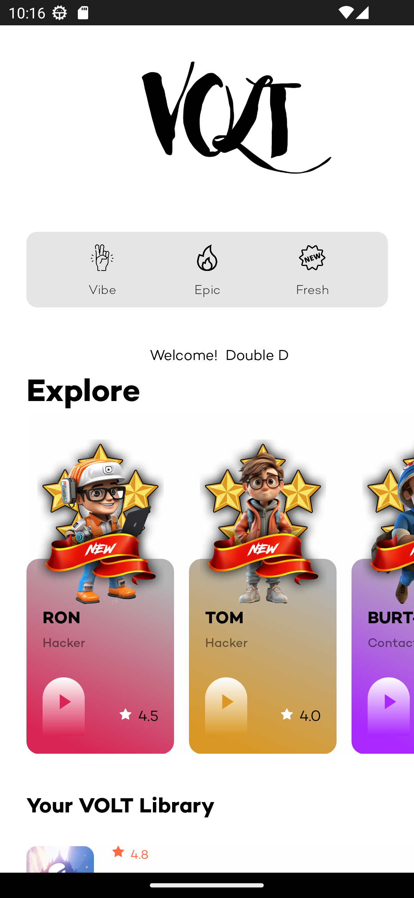
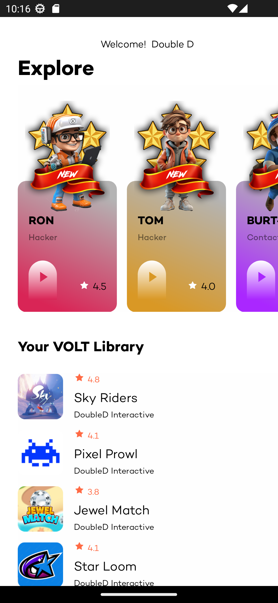
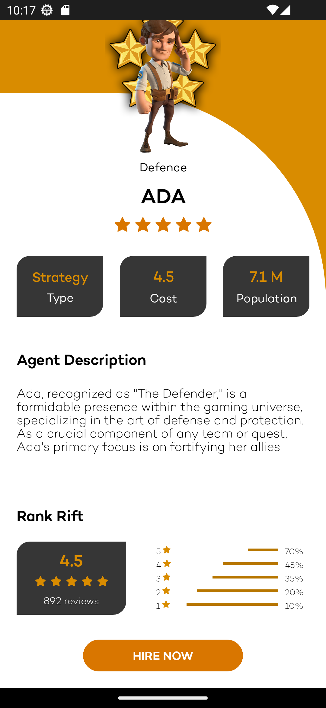
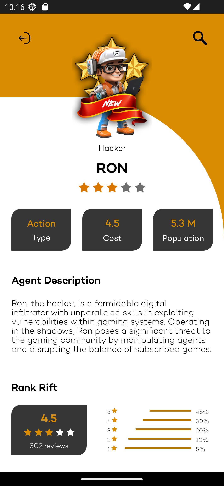
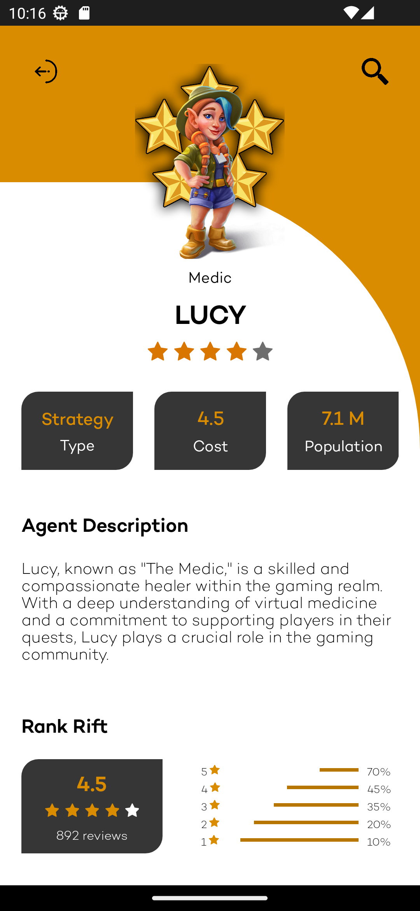
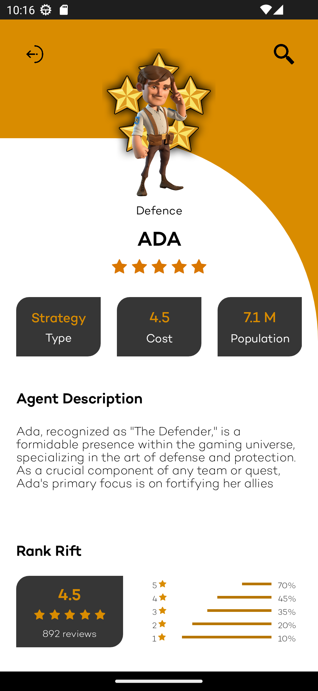

# VOLT LAUNCHER MOBILE


"VOLT Launcher" is an immersive and dynamic mobile application designed to revolutionize the gaming experience. Within this innovative platform, players can engage in a multitude of games, each featuring unique characters, challenges, and a vibrant virtual universe. The app introduces a diverse cast of characters, including hackers, builders, medics, and defenders, each contributing to the rich tapestry of the gaming community.

Players have the opportunity to explore captivating landscapes meticulously crafted by visionary builders like Kai, and experience the thrill of intense battles where medics such as Lucy play a vital role in ensuring survival. The app introduces a layer of intrigue with enigmatic figures like BURT-Y, offering a marketplace for the exchange of agents and creating a dynamic virtual economy.

However, players must be on guard, as the hacking prowess of characters like Ron and Tom introduces an element of unpredictability, challenging users to navigate through the virtual world with caution. The app encourages strategic thinking, teamwork, and adaptability as players build alliances, protect allies, and contend with the ever-present threat of hacking.

"The Virtual Realms App" transcends conventional gaming, providing an interactive and interconnected gaming ecosystem where players can shape their destinies, explore new dimensions, and experience the thrill of virtual adventures. Whether you're a fan of strategy, exploration, or teamwork, this app promises an unparalleled gaming experience that pushes the boundaries of the virtual realm.

## KEY FEATURES

<details open>
  <summary><strong>Diverse Characters</strong></summary>

  - Explore a vast array of characters, each with unique abilities and roles such as hackers, builders, medics, and defenders. Customize your gameplay experience by choosing the character that best suits your playstyle.
</details>

<details open>
  <summary><strong>Immersive Environments</strong></summary>

  - Immerse yourself in meticulously crafted virtual realms, designed by visionary builders like Kai. From towering skyscrapers to fantastical landscapes, every environment is a masterpiece waiting to be explored.
</details>

<details open>
  <summary><strong>Virtual Economy with BURT-Y:</strong></summary>

  - Enter a virtual marketplace facilitated by BURT-Y, a mysterious figure connecting players for the exchange of agents. Navigate the digital economy, buy and sell resources, and uncover the secrets of this enigmatic character.
</details>

<details open>
  <summary><strong>Hacking Challenges</strong></summary>

  - Face the hacking prowess of Ron and Tom, adding an element of unpredictability to your journey. Protect your agents, outsmart the hackers, and maintain balance in the virtual realm.
</details>

<details open>
  <summary><strong>Strategic Defense with Ada</strong></summary>

  - Team up with Ada, "The Defender," to fortify your allies and create a robust defense against virtual adversaries. Strategic thinking is crucial as you navigate through battles and challenges.
</details>

<details open>
  <summary><strong>Virtual Medicine with Lucy</strong></summary>

  -  Benefit from the healing abilities of Lucy, "The Medic," providing essential support in the midst of battles. Receive virtual potions, healing spells, and emotional support to ensure your survival and success.
</details>

## Screenshots
<details open>
  <summary><strong>Landing Page</strong></summary>
  
  

</details>

<details open>
  <summary><strong>VOLT Library</strong></summary>

  
  
</details>

<details open>
  <summary><strong>Buy</strong></summary>

  
  
</details>

<details open>
  <summary><strong>Agent Showcase</strong></summary>

  
  
</details>
<details open>
  <summary><strong>Agent Showcase</strong></summary>

  
  
</details>

<details open>
  <summary><strong>Agent Showcase</strong></summary>

  
  
</details>


## Project Summary

| Tittle         | Description             |
|------------------|-------------------------------------|
| **Devices**     | android, ios                  |
| **Languages**      | C#                    |
| **API**     |                              |
| **Version Control** | GitHub                        |
| **Deployment**   | Xamarin, Visual Studio                       |


## Installation

Provide step-by-step instructions on how to install your project.

```bash
# Example installation commands
git clone https://github.com/yourusername/yourrepository.git
cd yourrepository
npm install
